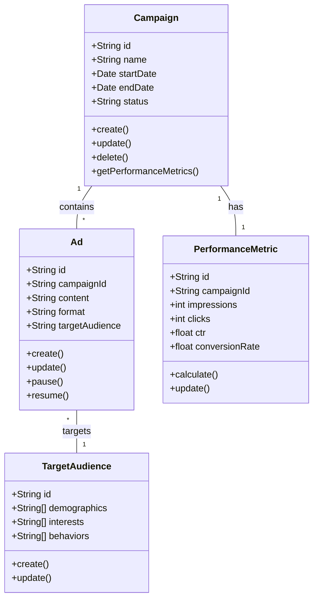
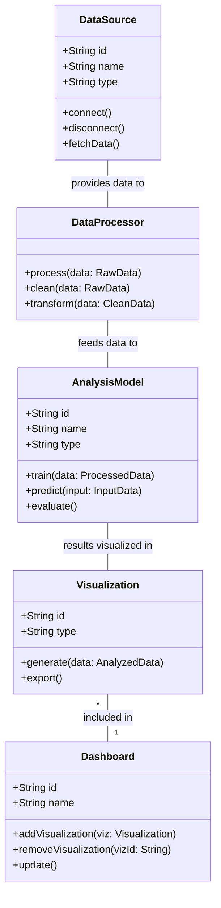

# Diagramas de Clase para Arquitectura de Software en Marketing Digital

En COL.marketing, utilizamos diagramas de clase para visualizar y diseñar la estructura de nuestras aplicaciones de marketing digital. Estos diagramas nos ayudan a entender las relaciones entre diferentes componentes del sistema y a mantener un código limpio y bien organizado.

## Ejemplo 1: Sistema de Gestión de Campañas

Veamos un diagrama de clase para nuestro sistema de gestión de campañas:


```
classDiagram
    class Campaign {
        +String id
        +String name
        +Date startDate
        +Date endDate
        +String status
        +create()
        +update()
        +delete()
        +getPerformanceMetrics()
    }
    class Ad {
        +String id
        +String campaignId
        +String content
        +String format
        +String targetAudience
        +create()
        +update()
        +pause()
        +resume()
    }
    class PerformanceMetric {
        +String id
        +String campaignId
        +int impressions
        +int clicks
        +float ctr
        +float conversionRate
        +calculate()
        +update()
    }
    class TargetAudience {
        +String id
        +String[] demographics
        +String[] interests
        +String[] behaviors
        +create()
        +update()
    }
    Campaign "1" -- "*" Ad : contains
    Campaign "1" -- "1" PerformanceMetric : has
    Ad "*" -- "1" TargetAudience : targets
```



Este diagrama ilustra la estructura de nuestro sistema de gestión de campañas:

1. La clase `Campaign` representa una campaña de marketing, con propiedades como nombre, fechas de inicio y fin, y métodos para crear, actualizar y eliminar campañas.
2. La clase `Ad` representa los anuncios individuales dentro de una campaña, con propiedades como contenido y formato.
3. La clase `PerformanceMetric` se encarga de almacenar y calcular métricas de rendimiento para cada campaña.
4. La clase `TargetAudience` define el público objetivo para los anuncios.

Las relaciones entre estas clases muestran que:
- Una campaña puede contener múltiples anuncios.
- Cada campaña tiene asociada una métrica de rendimiento.
- Cada anuncio está dirigido a un público objetivo específico.

## Ejemplo 2: Sistema de Análisis de Datos de Marketing

Ahora, veamos un diagrama de clase para nuestro sistema de análisis de datos:

```
classDiagram
    class DataSource {
        +String id
        +String name
        +String type
        +connect()
        +disconnect()
        +fetchData()
    }
    class DataProcessor {
        +process(data: RawData)
        +clean(data: RawData)
        +transform(data: CleanData)
    }
    class AnalysisModel {
        +String id
        +String name
        +String type
        +train(data: ProcessedData)
        +predict(input: InputData)
        +evaluate()
    }
    class Visualization {
        +String id
        +String type
        +generate(data: AnalyzedData)
        +export()
    }
    class Dashboard {
        +String id
        +String name
        +addVisualization(viz: Visualization)
        +removeVisualization(vizId: String)
        +update()
    }
    DataSource -- DataProcessor : provides data to
    DataProcessor -- AnalysisModel : feeds data to
    AnalysisModel -- Visualization : results visualized in
    Visualization "*" -- "1" Dashboard : included in
```



Este diagrama muestra la estructura de nuestro sistema de análisis de datos:

1. La clase `DataSource` representa las diferentes fuentes de datos que utilizamos (por ejemplo, Google Analytics, Facebook Ads, etc.).
2. `DataProcessor` se encarga de limpiar y transformar los datos crudos.
3. `AnalysisModel` representa nuestros modelos de análisis predictivo y descriptivo.
4. `Visualization` se utiliza para crear representaciones visuales de los datos analizados.
5. `Dashboard` permite organizar y presentar múltiples visualizaciones.

Las relaciones entre estas clases ilustran el flujo de datos en nuestro sistema:
- Los datos se obtienen de las fuentes, se procesan, se analizan y finalmente se visualizan en dashboards.

Estos diagramas de clase nos ayudan en COL.marketing a:
- Mantener una visión clara de la estructura de nuestros sistemas.
- Facilitar la comunicación entre los miembros del equipo de desarrollo.
- Identificar oportunidades de mejora y optimización en nuestra arquitectura.
- Asegurar que nuestros sistemas sean escalables y mantenibles a largo plazo.

Al utilizar estos diagramas en nuestro proceso de diseño y desarrollo, garantizamos que nuestras aplicaciones de marketing digital sean robustas, eficientes y capaces de evolucionar con las necesidades cambiantes del mercado.
