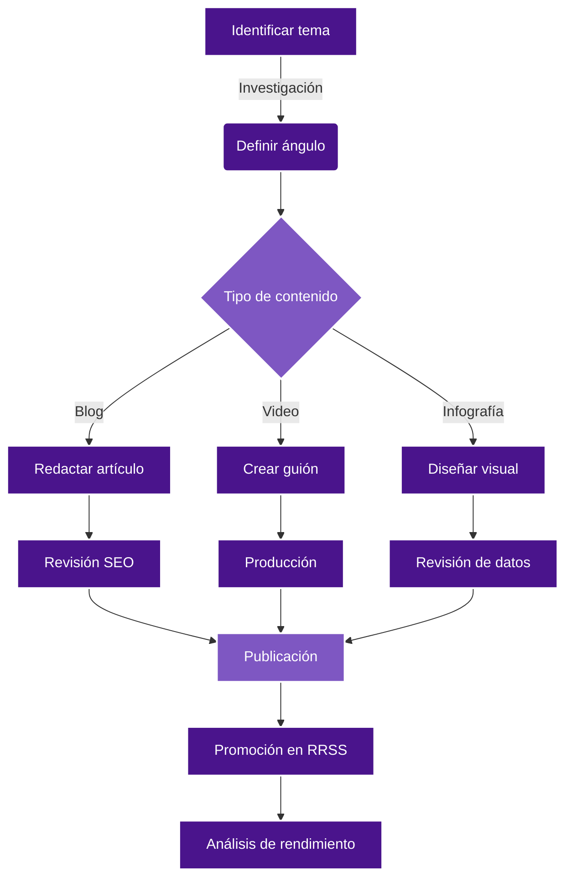
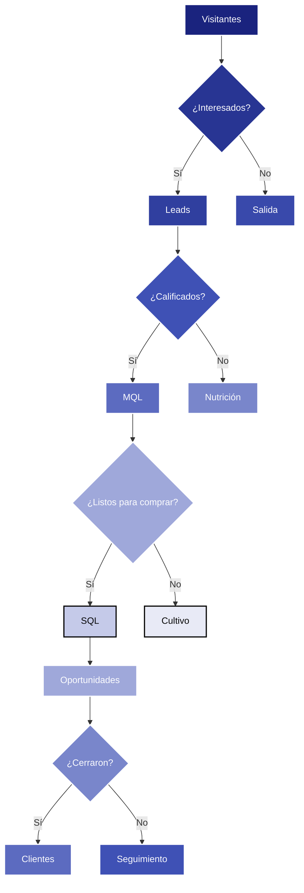

# Diagramas de flujo para Marketing Digital

En nuestro día a día en COL.marketing, nos enfrentamos a procesos complejos que necesitan ser visualizados de manera clara y efectiva. Los diagramas de flujo son una herramienta fundamental para lograr esto. Veamos cómo podemos utilizar Mermaid para crear diagramas de flujo que nos ayuden a optimizar nuestras estrategias de marketing digital.

## Ejemplo 1: Proceso de creación de contenido

Empecemos con un diagrama que ilustra nuestro proceso de creación de contenido:

```
graph TD
    A[Identificar tema] -->|Investigación| B(Definir ángulo)
    B --> C{Tipo de contenido}
    C -->|Blog| D[Redactar artículo]
    C -->|Video| E[Crear guión]
    C -->|Infografía| F[Diseñar visual]
    D --> G[Revisión SEO]
    E --> H[Producción]
    F --> I[Revisión de datos]
    G --> J[Publicación]
    H --> J
    I --> J
    J --> K[Promoción en RRSS]
    K --> L[Análisis de rendimiento]
    style A fill:#4a148c,stroke:#fff,stroke-width:2px,color:#fff
    style B fill:#4a148c,stroke:#fff,stroke-width:2px,color:#fff
    style C fill:#7e57c2,stroke:#fff,stroke-width:2px,color:#fff
    style D fill:#4a148c,stroke:#fff,stroke-width:2px,color:#fff
    style E fill:#4a148c,stroke:#fff,stroke-width:2px,color:#fff
    style F fill:#4a148c,stroke:#fff,stroke-width:2px,color:#fff
    style G fill:#4a148c,stroke:#fff,stroke-width:2px,color:#fff
    style H fill:#4a148c,stroke:#fff,stroke-width:2px,color:#fff
    style I fill:#4a148c,stroke:#fff,stroke-width:2px,color:#fff
    style J fill:#7e57c2,stroke:#fff,stroke-width:2px,color:#fff
    style K fill:#4a148c,stroke:#fff,stroke-width:2px,color:#fff
    style L fill:#4a148c,stroke:#fff,stroke-width:2px,color:#fff
```



En este diagrama, podemos visualizar claramente el flujo de trabajo que seguimos en COL.marketing para la creación de contenido. Comenzamos identificando el tema, pasamos por la fase de investigación y definición del ángulo, y luego nos dividimos según el tipo de contenido que vamos a crear. Cada tipo de contenido tiene su propio proceso, pero todos convergen en la publicación, promoción y análisis de rendimiento.

## Ejemplo 2: Embudo de conversión

Ahora, veamos cómo podemos utilizar Mermaid para visualizar nuestro embudo de conversión:

```
graph TD
    A[Visitantes] --> B{¿Interesados?}
    B -->|Sí| C[Leads]
    B -->|No| D[Salida]
    C --> E{¿Calificados?}
    E -->|Sí| F[MQL]
    E -->|No| G[Nutrición]
    F --> H{¿Listos para comprar?}
    H -->|Sí| I[SQL]
    H -->|No| J[Cultivo]
    I --> K[Oportunidades]
    K --> L{¿Cerraron?}
    L -->|Sí| M[Clientes]
    L -->|No| N[Seguimiento]
    style A fill:#1a237e,stroke:#fff,stroke-width:2px,color:#fff
    style B fill:#283593,stroke:#fff,stroke-width:2px,color:#fff
    style C fill:#303f9f,stroke:#fff,stroke-width:2px,color:#fff
    style D fill:#3949ab,stroke:#fff,stroke-width:2px,color:#fff
    style E fill:#3f51b5,stroke:#fff,stroke-width:2px,color:#fff
    style F fill:#5c6bc0,stroke:#fff,stroke-width:2px,color:#fff
    style G fill:#7986cb,stroke:#fff,stroke-width:2px,color:#fff
    style H fill:#9fa8da,stroke:#fff,stroke-width:2px,color:#fff
    style I fill:#c5cae9,stroke:#000,stroke-width:2px,color:#000
    style J fill:#e8eaf6,stroke:#000,stroke-width:2px,color:#000
    style K fill:#9fa8da,stroke:#fff,stroke-width:2px,color:#fff
    style L fill:#7986cb,stroke:#fff,stroke-width:2px,color:#fff
    style M fill:#5c6bc0,stroke:#fff,stroke-width:2px,color:#fff
    style N fill:#3f51b5,stroke:#fff,stroke-width:2px,color:#fff
```



Este diagrama nos permite visualizar de manera efectiva cómo los visitantes de nuestro sitio web se convierten en clientes. Cada etapa del embudo está claramente definida, y podemos ver los diferentes caminos que puede tomar un lead. Esto nos ayuda a identificar dónde podríamos estar perdiendo oportunidades y dónde podríamos mejorar nuestro proceso de conversión.

Los diagramas de flujo en Mermaid nos permiten representar visualmente procesos complejos de una manera clara y comprensible. En COL.marketing, utilizamos estos diagramas para comunicar estrategias, optimizar procesos y asegurarnos de que todo el equipo esté alineado con nuestros objetivos de marketing digital.
