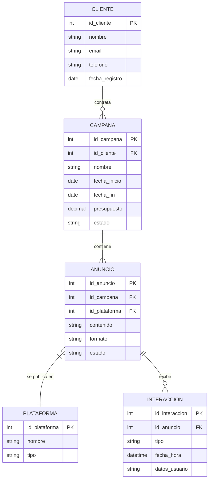
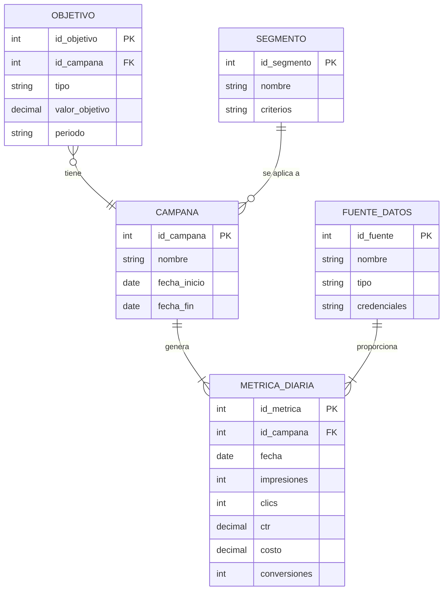

# Diagramas Entidad-Relación para Bases de Datos en Marketing Digital

En COL.marketing, utilizamos diagramas entidad-relación (ER) para diseñar y visualizar la estructura de nuestras bases de datos. Estos diagramas son cruciales para entender cómo se relacionan los diferentes conjuntos de datos en nuestras aplicaciones de marketing digital.

## Ejemplo 1: Sistema de Gestión de Clientes y Campañas

Veamos un diagrama ER que representa la estructura de datos para nuestro sistema de gestión de clientes y campañas:


```
erDiagram
    CLIENTE ||--o{ CAMPANA : "contrata"
    CLIENTE {
        int id_cliente PK
        string nombre
        string email
        string telefono
        date fecha_registro
    }
    CAMPANA ||--|{ ANUNCIO : "contiene"
    CAMPANA {
        int id_campana PK
        int id_cliente FK
        string nombre
        date fecha_inicio
        date fecha_fin
        decimal presupuesto
        string estado
    }
    ANUNCIO }|--|| PLATAFORMA : "se publica en"
    ANUNCIO {
        int id_anuncio PK
        int id_campana FK
        int id_plataforma FK
        string contenido
        string formato
        string estado
    }
    PLATAFORMA {
        int id_plataforma PK
        string nombre
        string tipo
    }
    ANUNCIO ||--o{ INTERACCION : "recibe"
    INTERACCION {
        int id_interaccion PK
        int id_anuncio FK
        string tipo
        datetime fecha_hora
        string datos_usuario
    }
```



Este diagrama ER ilustra la estructura de datos de nuestro sistema:

1. **CLIENTE**: Almacena información sobre nuestros clientes.
2. **CAMPANA**: Representa las campañas de marketing contratadas por los clientes.
3. **ANUNCIO**: Contiene detalles sobre los anuncios individuales dentro de cada campaña.
4. **PLATAFORMA**: Registra las diferentes plataformas donde se publican los anuncios.
5. **INTERACCION**: Captura las interacciones de los usuarios con los anuncios.

Las relaciones entre estas entidades muestran que:
- Un cliente puede tener múltiples campañas.
- Una campaña contiene varios anuncios.
- Cada anuncio se publica en una plataforma específica.
- Un anuncio puede recibir múltiples interacciones.

## Ejemplo 2: Sistema de Análisis de Rendimiento de Marketing

Ahora, veamos un diagrama ER para nuestro sistema de análisis de rendimiento:

```
erDiagram
    CAMPANA ||--|{ METRICA_DIARIA : "genera"
    CAMPANA {
        int id_campana PK
        string nombre
        date fecha_inicio
        date fecha_fin
    }
    METRICA_DIARIA {
        int id_metrica PK
        int id_campana FK
        date fecha
        int impresiones
        int clics
        decimal ctr
        decimal costo
        int conversiones
    }
    OBJETIVO }o--|| CAMPANA : "tiene"
    OBJETIVO {
        int id_objetivo PK
        int id_campana FK
        string tipo
        decimal valor_objetivo
        string periodo
    }
    SEGMENTO ||--o{ CAMPANA : "se aplica a"
    SEGMENTO {
        int id_segmento PK
        string nombre
        string criterios
    }
    FUENTE_DATOS ||--|{ METRICA_DIARIA : "proporciona"
    FUENTE_DATOS {
        int id_fuente PK
        string nombre
        string tipo
        string credenciales
    }
```



Este diagrama ER muestra la estructura de datos para nuestro sistema de análisis:

1. **CAMPANA**: Representa las campañas de marketing que estamos analizando.
2. **METRICA_DIARIA**: Almacena las métricas de rendimiento diarias de cada campaña.
3. **OBJETIVO**: Contiene los objetivos establecidos para cada campaña.
4. **SEGMENTO**: Define los segmentos de audiencia aplicados a las campañas.
5. **FUENTE_DATOS**: Registra las fuentes de datos de donde obtenemos las métricas.

Las relaciones entre estas entidades indican que:
- Una campaña genera múltiples métricas diarias.
- Cada campaña puede tener varios objetivos.
- Un segmento puede aplicarse a múltiples campañas.
- Las métricas diarias pueden provenir de diferentes fuentes de datos.

Estos diagramas ER nos ayudan en COL.marketing a:
- Diseñar bases de datos eficientes y escalables para nuestras aplicaciones.
- Entender las relaciones entre diferentes conjuntos de datos.
- Facilitar la creación de consultas complejas para el análisis de datos.
- Mantener la integridad de los datos a través de relaciones bien definidas.
- Comunicar la estructura de datos a los equipos de desarrollo y análisis.

Al utilizar estos diagramas en nuestro proceso de diseño de bases de datos, aseguramos que nuestras aplicaciones de marketing digital puedan manejar y analizar datos de manera eficiente, proporcionando insights valiosos a nuestros clientes.
