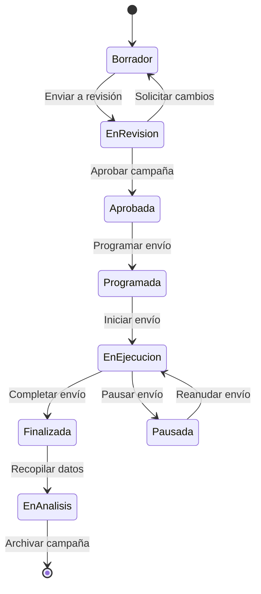
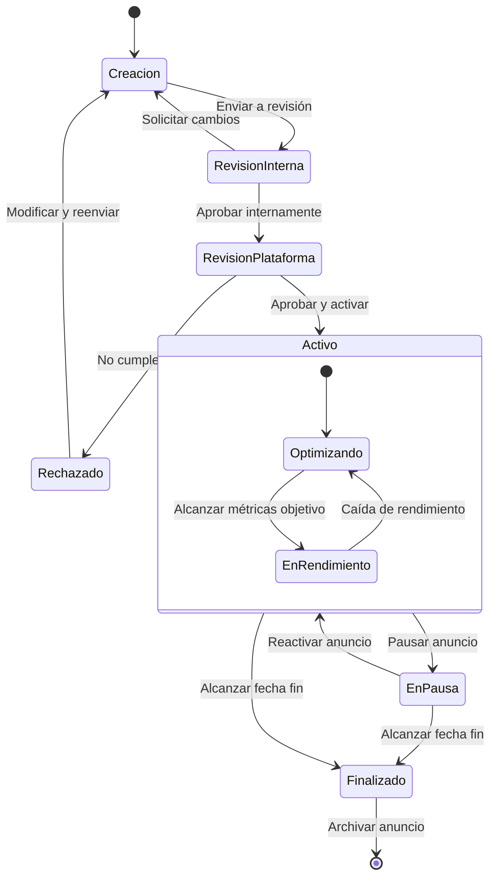

# Diagramas de Estado para Flujos de Trabajo en Campañas de Marketing Digital

En COL.marketing, utilizamos diagramas de estado para visualizar y gestionar los diferentes estados por los que pasa una campaña de marketing digital. Estos diagramas nos ayudan a entender el ciclo de vida de nuestras campañas y a optimizar nuestros procesos.

## Ejemplo 1: Ciclo de Vida de una Campaña de Email Marketing

Veamos un diagrama de estado que representa el ciclo de vida de una campaña de email marketing:

```
stateDiagram-v2
    [*] --> Borrador
    Borrador --> EnRevision : Enviar a revisión
    EnRevision --> Borrador : Solicitar cambios
    EnRevision --> Aprobada : Aprobar campaña
    Aprobada --> Programada : Programar envío
    Programada --> EnEjecucion : Iniciar envío
    EnEjecucion --> Finalizada : Completar envío
    EnEjecucion --> Pausada : Pausar envío
    Pausada --> EnEjecucion : Reanudar envío
    Finalizada --> EnAnalisis : Recopilar datos
    EnAnalisis --> [*] : Archivar campaña
```



Este diagrama ilustra los diferentes estados de una campaña de email marketing:

1. **Borrador**: Estado inicial donde se crea y edita el contenido del email.
2. **EnRevision**: La campaña está siendo revisada por el equipo o el cliente.
3. **Aprobada**: El contenido y la estrategia han sido aprobados.
4. **Programada**: La campaña está lista y tiene una fecha de envío establecida.
5. **EnEjecucion**: Los emails están siendo enviados a los suscriptores.
6. **Pausada**: El envío se ha detenido temporalmente.
7. **Finalizada**: Todos los emails han sido enviados.
8. **EnAnalisis**: Se están recopilando y analizando los datos de rendimiento.

Las transiciones entre estados muestran las acciones que llevamos a cabo, como "Enviar a revisión" o "Pausar envío".

## Ejemplo 2: Estados de un Anuncio en Redes Sociales

Ahora, veamos un diagrama de estado para el ciclo de vida de un anuncio en redes sociales:


```
stateDiagram-v2
    [*] --> Creacion
    Creacion --> RevisionInterna : Enviar a revisión
    RevisionInterna --> Creacion : Solicitar cambios
    RevisionInterna --> RevisionPlataforma : Aprobar internamente
    RevisionPlataforma --> Rechazado : No cumple políticas
    RevisionPlataforma --> Activo : Aprobar y activar
    Rechazado --> Creacion : Modificar y reenviar
    Activo --> EnPausa : Pausar anuncio
    EnPausa --> Activo : Reactivar anuncio
    Activo --> Finalizado : Alcanzar fecha fin
    EnPausa --> Finalizado : Alcanzar fecha fin
    Finalizado --> [*] : Archivar anuncio
    
    state Activo {
        [*] --> Optimizando
        Optimizando --> EnRendimiento : Alcanzar métricas objetivo
        EnRendimiento --> Optimizando : Caída de rendimiento
    }
```



Este diagrama muestra los diferentes estados de un anuncio en redes sociales:

1. **Creacion**: Se está diseñando y configurando el anuncio.
2. **RevisionInterna**: El equipo de COL.marketing revisa el anuncio.
3. **RevisionPlataforma**: La plataforma de redes sociales revisa el anuncio.
4. **Rechazado**: El anuncio no cumple con las políticas de la plataforma.
5. **Activo**: El anuncio está en ejecución y mostrándose a usuarios.
   - **Optimizando**: Se están ajustando parámetros para mejorar el rendimiento.
   - **EnRendimiento**: El anuncio ha alcanzado las métricas objetivo.
6. **EnPausa**: El anuncio se ha detenido temporalmente.
7. **Finalizado**: La campaña ha terminado.

Las transiciones muestran las acciones como "Pausar anuncio" o "Reactivar anuncio", y también incluyen eventos como "Alcanzar fecha fin".

Estos diagramas de estado nos ayudan en COL.marketing a:
- Visualizar claramente el flujo de trabajo de nuestras campañas y anuncios.
- Identificar posibles cuellos de botella o puntos de mejora en nuestros procesos.
- Capacitar a nuevos miembros del equipo sobre nuestros flujos de trabajo.
- Comunicar de manera efectiva el estado actual de las campañas a nuestros clientes.
- Automatizar ciertos procesos basados en los cambios de estado.

Al utilizar estos diagramas en nuestra gestión de campañas, aseguramos que nuestros procesos de marketing digital sean eficientes, consistentes y fáciles de seguir para todo el equipo.
