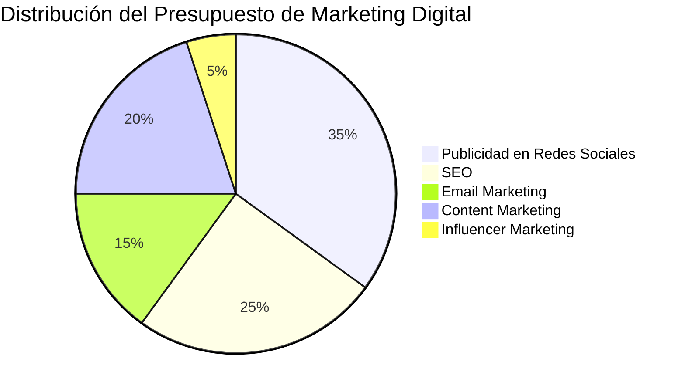
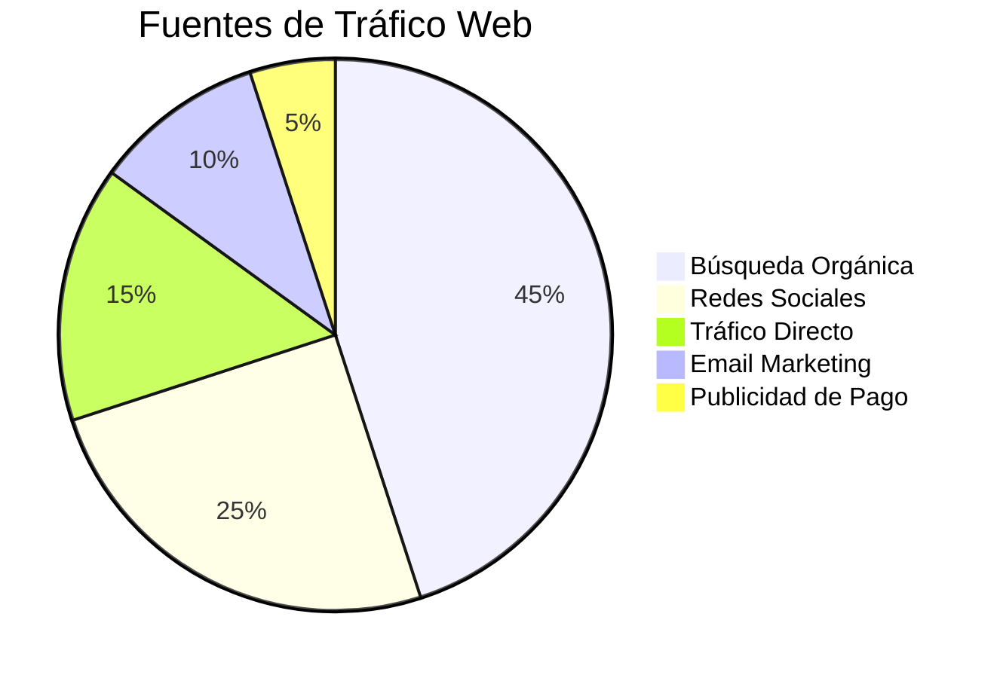
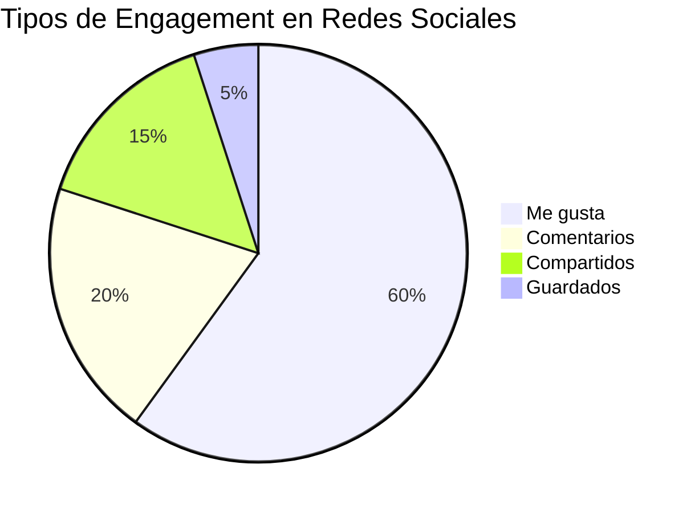

# Diagramas de Torta para Visualización de Datos en Marketing Digital

En COL.marketing, utilizamos diagramas de torta para presentar de manera clara y concisa la distribución de datos en nuestros informes de marketing digital. Estos gráficos son particularmente útiles para mostrar proporciones y porcentajes de un todo.

## Ejemplo 1: Distribución del Presupuesto de Marketing Digital

Veamos un diagrama de torta que representa la distribución del presupuesto de marketing digital:

Este diagrama nos muestra cómo se distribuye el presupuesto de marketing digital entre diferentes canales:

1. Publicidad en Redes Sociales: 35%
2. SEO (Search Engine Optimization): 25%
3. Email Marketing: 15%
4. Content Marketing: 20%
5. Influencer Marketing: 5%

Este tipo de visualización nos permite identificar rápidamente dónde estamos invirtiendo la mayor parte de nuestros recursos y ajustar nuestra estrategia según sea necesario.

## Ejemplo 2: Fuentes de Tráfico Web

Ahora, veamos un diagrama de torta que muestra las principales fuentes de tráfico a un sitio web:

Este diagrama ilustra la proporción de tráfico web proveniente de diferentes fuentes:

1. Búsqueda Orgánica: 45%
2. Redes Sociales: 25%
3. Tráfico Directo: 15%
4. Email Marketing: 10%
5. Publicidad de Pago: 5%

Esta visualización nos ayuda a entender qué canales están generando más visitas a nuestro sitio web y dónde podríamos necesitar enfocar más esfuerzos.

## Ejemplo 3: Engagement en Redes Sociales

Por último, veamos un diagrama de torta que muestra la distribución de diferentes tipos de engagement en redes sociales:

Este diagrama representa los diferentes tipos de interacciones que los usuarios tienen con nuestro contenido en redes sociales:

1. Me gusta: 60%
2. Comentarios: 20%
3. Compartidos: 15%
4. Guardados: 5%

Esta visualización nos permite entender qué tipo de engagement estamos generando más frecuentemente, lo que puede informar nuestra estrategia de contenido.

En COL.marketing, utilizamos estos diagramas de torta para:

- Presentar datos complejos de manera simple y fácil de entender.
- Mostrar la composición relativa de diferentes elementos en nuestras estrategias de marketing.
- Identificar rápidamente áreas que requieren más atención o recursos.
- Comunicar eficazmente los resultados de nuestras campañas a clientes y stakeholders.

Al incorporar estos diagramas en nuestros informes y presentaciones, facilitamos la toma de decisiones basada en datos y aseguramos que nuestros clientes puedan comprender fácilmente el impacto de nuestras estrategias de marketing digital.
