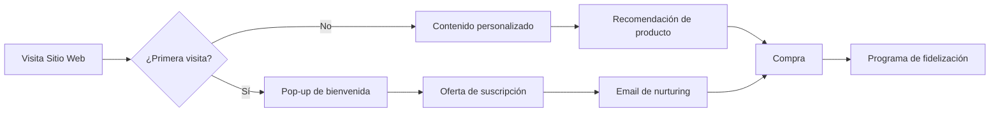
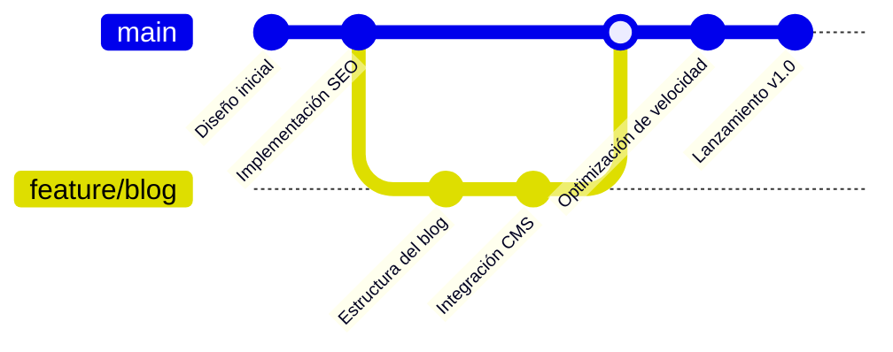
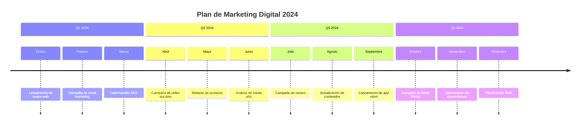
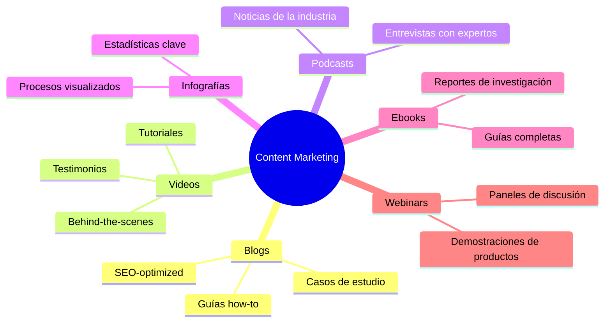
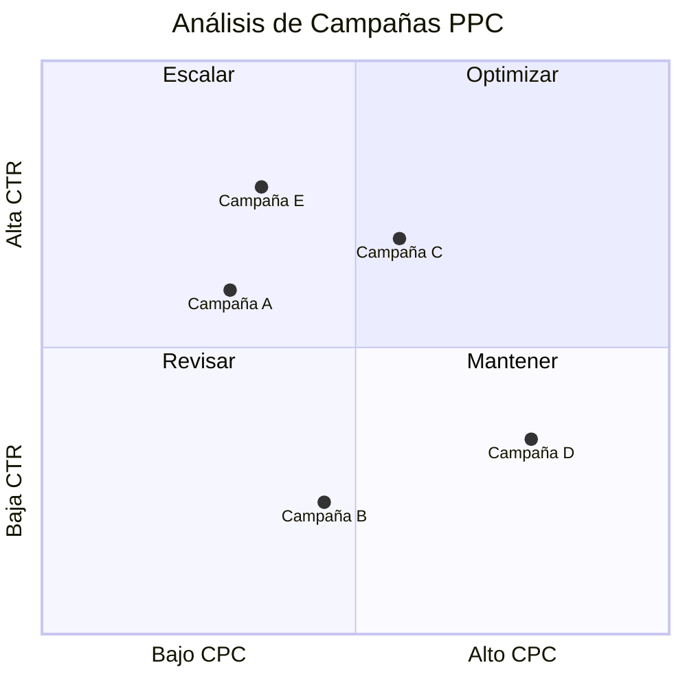
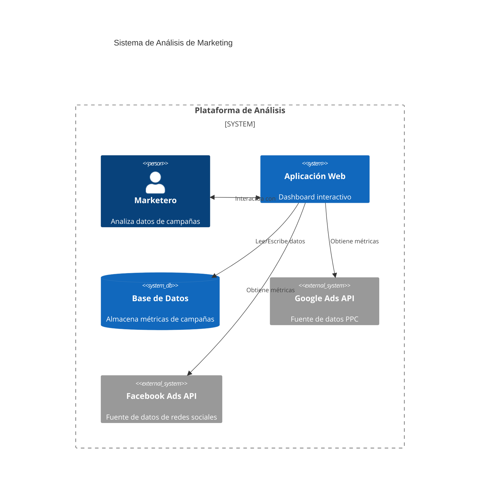

# Guía de Diagramas para Marketing Digital

En el dinámico mundo del marketing digital, la visualización efectiva de datos, procesos y estrategias es fundamental para el éxito. En COL.marketing, hemos desarrollado esta guía completa que abarca los tipos de diagramas más relevantes para nuestro campo. A continuación, presentamos un recorrido por los diferentes tipos de diagramas que utilizamos en nuestro día a día:

## 1. [Diagramas de Flujo para Marketing Digital](./Diagramas-de-flujo-para-Marketing-Digital.md)
Comenzamos nuestra exploración con los diagramas de flujo, herramientas esenciales para visualizar y optimizar procesos complejos. Estos diagramas nos permiten mapear desde la creación de contenido hasta el embudo de conversión, proporcionando una clara visión de nuestros procesos operativos.

## 2. [Diagramas de Secuencia para Firebase y NodeJS](./Diagramas-de-secuencia-para-Firebase-y-NodeJS.md)
A medida que nos adentramos en el aspecto técnico, exploramos los diagramas de secuencia. Estos son cruciales para ilustrar la interacción entre los diferentes componentes de nuestros sistemas, especialmente en el desarrollo de aplicaciones con Firebase y NodeJS.

## 3. [Diagramas de Gantt para Gestión de Proyectos de Marketing Digital](./Diagramas-de-Gantt-para-Gestion-de-Proyectos-de-Marketing-Digital.md)
La planificación y seguimiento de proyectos es vital en nuestro campo. Aquí, examinamos cómo los diagramas de Gantt nos ayudan a gestionar eficientemente nuestras campañas de marketing, permitiéndonos visualizar plazos y recursos.

## 4. [Diagramas de Clase para Arquitectura de Software en Marketing Digital](./Diagramas-de-Clase-para-Arquitectura-de-Software-en-Marketing-Digital.md)
Para aquellos de nosotros involucrados en el desarrollo de software, los diagramas de clase son indispensables. Esta sección muestra cómo los utilizamos para diseñar y visualizar la estructura de nuestras aplicaciones de marketing digital.

## 5. [Diagramas de Estado para Flujos de Trabajo en Campañas de Marketing Digital](./Diagramas_de_Estado_para_Flujos_de_Trabajo_en_Campañas_de_Marketing_Digital.md)
Comprender los diferentes estados de nuestras campañas y anuncios es crucial. Aquí, exploramos cómo los diagramas de estado nos ayudan a gestionar y optimizar nuestros flujos de trabajo.

## 6. [Diagramas Entidad-Relación para Bases de Datos en Marketing Digital](./Diagramas_Entidad-Relación_para_Bases_de_Datos_en_Marketing_Digital.md)
Las bases de datos son el corazón de nuestras operaciones. En esta sección, analizamos cómo los diagramas ER nos permiten diseñar bases de datos eficientes que soporten nuestras aplicaciones de marketing.

## 7. [Diagramas de Torta para Visualización de Datos en Marketing Digital](./Diagramas_de_Torta_para_Visualización_de_Datos_en_Marketing_Digital.md)
La presentación clara de datos es esencial en nuestro campo. Aquí, mostramos cómo los diagramas de torta nos ofrecen una forma concisa de presentar distribuciones de datos, como presupuestos o fuentes de tráfico.

## 8. [Diagramas de Viaje del Usuario en Marketing Digital](./Diagramas_de_Viaje_del_Usuario_en_Marketing_Digital.md)
Finalmente, nos sumergimos en la experiencia del cliente. Los diagramas de viaje del usuario nos permiten mapear y analizar la interacción del cliente con nuestras marcas y productos, identificando oportunidades de mejora en nuestras estrategias.

En COL.marketing, estos diagramas son más que simples herramientas de visualización; son catalizadores de innovación, eficiencia y éxito en nuestras estrategias de marketing digital. Al implementarlos en nuestro trabajo diario, hemos experimentado:

- Una mejora significativa en la comunicación entre equipos y con clientes.
- Una optimización continua de nuestros procesos.
- Una toma de decisiones más informada y estratégica.
- Una planificación más efectiva de campañas y proyectos.
- Un compromiso con la mejora continua de nuestras prácticas.

Esta guía es nuestro recurso go-to para aprovechar el poder de la visualización en el marketing digital. Invitamos a todo nuestro equipo a explorar cada sección en detalle y a incorporar estos diagramas en su trabajo diario. Juntos, continuaremos impulsando nuestro crecimiento, mejorando nuestros servicios y, lo más importante, generando resultados excepcionales para nuestros clientes.

# Diagramas y Gráficos Adicionales para Marketing Digital

En COL.marketing, siempre buscamos formas innovadoras de visualizar y analizar datos. Aquí presentamos una lista ampliada de diagramas y gráficos que aún no hemos tratado en nuestra guía principal, pero que pueden ser valiosos para nuestro trabajo en marketing digital:

| Tipo de Diagrama | Descripción | Uso en Marketing Digital |
|-------------------|-------------|--------------------------|
| Flowchart (LR) | Diagrama de flujo de izquierda a derecha | Mapeo de customer journey |
| Gitgraph | Muestra el historial de commits de Git | Seguimiento de versiones en proyectos de desarrollo web |
| Timeline | Muestra eventos en una línea de tiempo | Planificación de campañas a largo plazo |
| Mindmap | Representa ideas o conceptos relacionados | Brainstorming de estrategias de contenido |
| Quadrant Chart | Divide datos en cuatro cuadrantes | Análisis de rendimiento de campañas |
| C4 Diagram | Muestra la arquitectura de software | Diseño de sistemas de análisis de marketing |
| Sankey Diagram | Muestra flujos y sus cantidades | Visualización de conversiones en funnel de ventas |
| Radar Chart | Compara múltiples variables | Evaluación de KPIs de campañas |
| Heatmap | Muestra datos en una matriz de colores | Análisis de engagement en redes sociales |
| Bubble Chart | Compara tres dimensiones de datos | Comparación de productos por ventas, margen y popularidad |
| Treemap | Muestra datos jerárquicos como rectángulos anidados | Visualización de estructura de gastos en marketing |
| Network Graph | Muestra conexiones entre entidades | Mapeo de relaciones entre influencers y marcas |

A continuación, presentamos ejemplos de cada tipo de diagrama en el contexto del marketing digital:

1. Flowchart (LR) - Customer Journey

2. Gitgraph - Desarrollo de Sitio Web

3. Timeline - Planificación de Campaña Anual

4. Mindmap - Estrategia de Content Marketing

5. Quadrant Chart - Análisis de Campañas PPC

6. C4 Diagram - Sistema de Análisis de Marketing

Estos diagramas adicionales nos ofrecen nuevas formas de visualizar y analizar nuestros datos y procesos en marketing digital. Cada uno tiene sus propias fortalezas y puede ser especialmente útil en diferentes aspectos de nuestro trabajo.