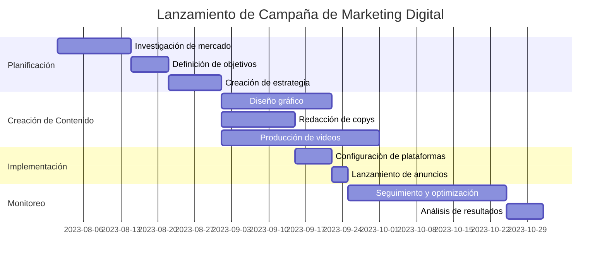
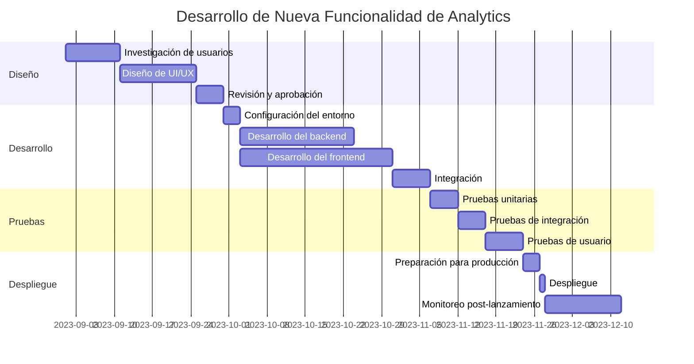

# Diagramas de Gantt para Gestión de Proyectos de Marketing Digital

En COL.marketing, la gestión eficiente de proyectos es fundamental para el éxito de nuestras campañas de marketing digital. Utilizamos diagramas de Gantt para visualizar y planificar nuestros proyectos, lo que nos permite mantener un seguimiento claro de las tareas, los plazos y los recursos. Veamos cómo implementamos estos diagramas en nuestro flujo de trabajo.

## Ejemplo 1: Lanzamiento de una Campaña de Marketing Digital

Aquí tenemos un diagrama que muestra la planificación para el lanzamiento de una campaña de marketing digital:

```
gantt
    title Lanzamiento de Campaña de Marketing Digital
    dateFormat  YYYY-MM-DD
    section Planificación
    Investigación de mercado    :a1, 2023-08-01, 14d
    Definición de objetivos     :a2, after a1, 7d
    Creación de estrategia      :a3, after a2, 10d
    section Creación de Contenido
    Diseño gráfico              :b1, after a3, 21d
    Redacción de copys          :b2, after a3, 14d
    Producción de videos        :b3, after a3, 30d
    section Implementación
    Configuración de plataformas :c1, after b2, 7d
    Lanzamiento de anuncios     :c2, after c1, 3d
    section Monitoreo
    Seguimiento y optimización  :d1, after c2, 30d
    Análisis de resultados      :d2, after d1, 7d
```



Este diagrama nos permite visualizar claramente:

1. Las diferentes fases del proyecto: Planificación, Creación de Contenido, Implementación y Monitoreo.
2. La duración de cada tarea y cómo se relacionan entre sí.
3. Las dependencias entre tareas, como la creación de estrategia antes de comenzar con la creación de contenido.

## Ejemplo 2: Desarrollo de una Nueva Funcionalidad en Nuestra Plataforma de Analytics

Ahora, veamos cómo planificamos el desarrollo de una nueva funcionalidad en nuestra plataforma de analytics:

```
gantt
    title Desarrollo de Nueva Funcionalidad de Analytics
    dateFormat  YYYY-MM-DD
    section Diseño
    Investigación de usuarios   :a1, 2023-09-01, 10d
    Diseño de UI/UX             :a2, after a1, 14d
    Revisión y aprobación       :a3, after a2, 5d
    section Desarrollo
    Configuración del entorno   :b1, after a3, 3d
    Desarrollo del backend      :b2, after b1, 21d
    Desarrollo del frontend     :b3, after b1, 28d
    Integración                 :b4, after b2 b3, 7d
    section Pruebas
    Pruebas unitarias           :c1, after b4, 5d
    Pruebas de integración      :c2, after c1, 5d
    Pruebas de usuario          :c3, after c2, 7d
    section Despliegue
    Preparación para producción :d1, after c3, 3d
    Despliegue                  :d2, after d1, 1d
    Monitoreo post-lanzamiento  :d3, after d2, 14d
```



Este diagrama nos ayuda a:

1. Visualizar las cuatro fases principales del proyecto: Diseño, Desarrollo, Pruebas y Despliegue.
2. Identificar las tareas críticas y sus dependencias.
3. Planificar los recursos necesarios en cada etapa del proyecto.

En COL.marketing, estos diagramas son herramientas esenciales para nuestra gestión de proyectos. Nos permiten:

- Comunicar claramente los plazos y las expectativas a todo el equipo y a los clientes.
- Identificar posibles cuellos de botella o retrasos antes de que ocurran.
- Ajustar los recursos y prioridades de manera eficiente a lo largo del proyecto.
- Mantener una visión general del progreso del proyecto en todo momento.

Al utilizar estos diagramas en nuestra planificación, aseguramos que nuestros proyectos de marketing digital y desarrollo de plataformas se ejecuten de manera eficiente y efectiva, cumpliendo con los plazos y entregando resultados de alta calidad a nuestros clientes.
