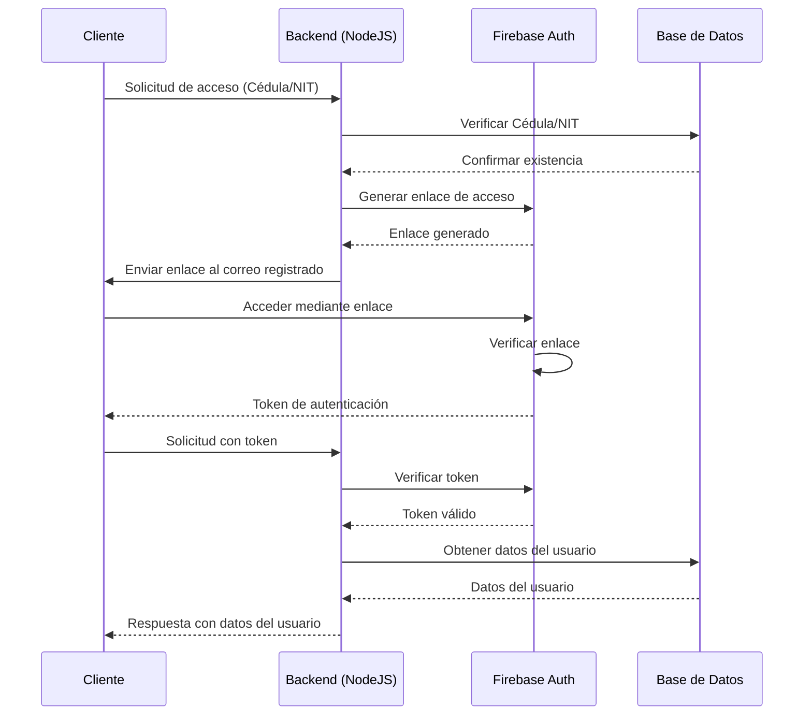
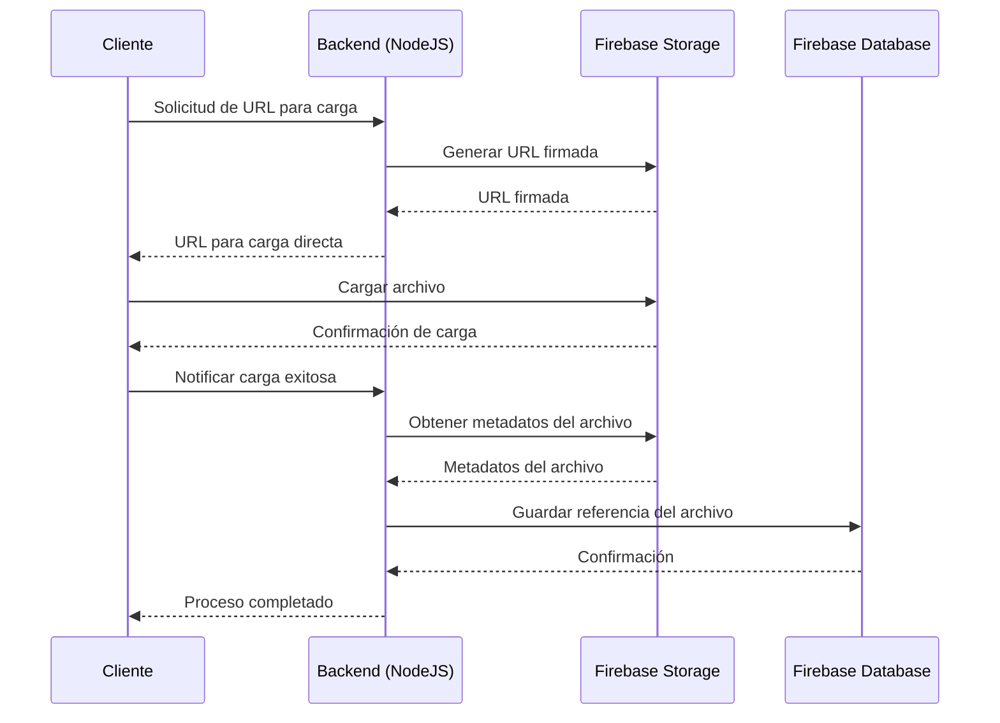
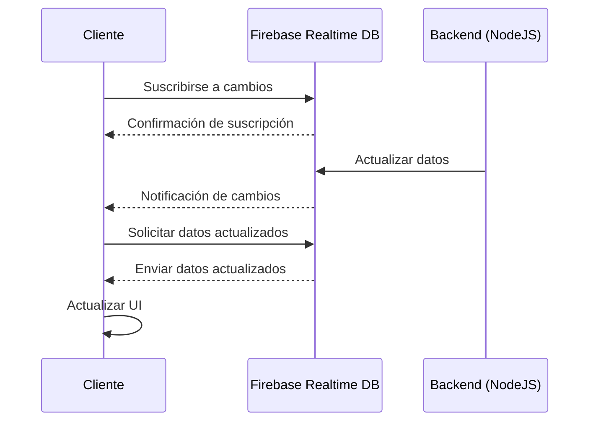

# Diagramas de secuencia para Firebase y NodeJS

En COL.marketing, utilizamos Firebase y NodeJS en muchos de nuestros proyectos de desarrollo. Los diagramas de secuencia son especialmente útiles para visualizar la interacción entre diferentes componentes de nuestros sistemas. Veamos diagramas de secuencia que nos ayudan a entender y optimizar nuestros flujos de trabajo.

## Ejemplo 1: Autenticación de usuario con Firebase

Aquí tenemos un diagrama que muestra nuestro proceso de autenticación de usuario utilizando Firebase, adaptado a las prácticas de seguridad colombianas:

Este diagrama ilustra nuestro proceso de autenticación segura:

1. El cliente proporciona su Cédula o NIT.
2. Verificamos la existencia de este número en nuestra base de datos.
3. Generamos un enlace de acceso único mediante Firebase Auth.
4. Enviamos el enlace al correo electrónico registrado del usuario.
5. El usuario accede a través de este enlace seguro.
6. Firebase verifica el enlace y proporciona un token de autenticación.
7. El backend verifica el token y obtiene los datos del usuario.

## Ejemplo 2: Proceso de carga de archivos a Firebase Storage

Ahora, veamos cómo representamos el proceso de carga de archivos a Firebase Storage:

Este diagrama muestra el proceso de carga de archivos:

1. El cliente solicita una URL para la carga.
2. Nuestro backend NodeJS genera una URL firmada usando Firebase Storage.
3. El cliente carga el archivo directamente a Firebase Storage.
4. Una vez completada la carga, el cliente notifica al backend.
5. El backend obtiene los metadatos del archivo y guarda una referencia en Firebase Database.

## Ejemplo 3: Sincronización en tiempo real con Firebase Realtime Database

Veamos cómo representamos la sincronización en tiempo real de datos:

Este diagrama ilustra:

1. El cliente se suscribe a cambios en Firebase Realtime Database.
2. Cuando el backend actualiza los datos, Firebase notifica al cliente.
3. El cliente solicita y recibe los datos actualizados.
4. La interfaz de usuario se actualiza con la nueva información.

Estos diagramas de secuencia nos ayudan a visualizar y entender mejor los procesos complejos en nuestras aplicaciones. En COL.marketing, los usamos para documentar nuestros sistemas, identificar posibles cuellos de botella y optimizar nuestros flujos de trabajo. Además, son una excelente herramienta para comunicar estos procesos a nuevos miembros del equipo o a clientes que necesitan entender cómo funcionan nuestras soluciones de manera segura y eficiente.
