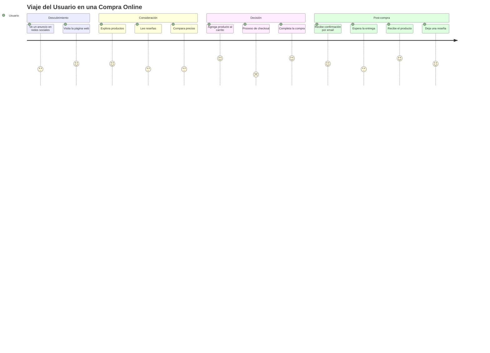
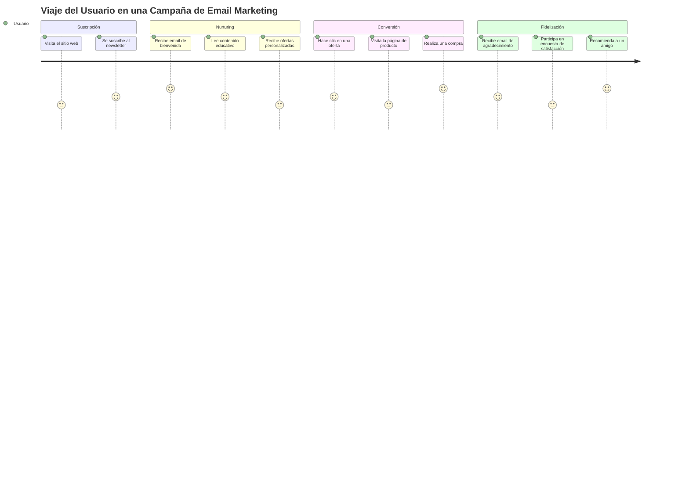

# Diagramas de Viaje del Usuario en Marketing Digital

En COL.marketing, utilizamos diagramas de viaje del usuario para mapear y analizar la experiencia del cliente a lo largo de su interacción con una marca o producto. Estos diagramas nos ayudan a identificar puntos de contacto clave, emociones del usuario y oportunidades de mejora en la estrategia de marketing digital.

## Ejemplo 1: Viaje del Usuario en una Compra Online

Veamos un diagrama que representa el viaje de un usuario durante una compra online:

```
journey
    title Viaje del Usuario en una Compra Online
    section Descubrimiento
      Ve un anuncio en redes sociales: 3: Usuario
      Visita la página web: 4: Usuario
    section Consideración
      Explora productos: 4: Usuario
      Lee reseñas: 3: Usuario
      Compara precios: 3: Usuario
    section Decisión
      Agrega producto al carrito: 5: Usuario
      Proceso de checkout: 2: Usuario
      Completa la compra: 5: Usuario
    section Post-compra
      Recibe confirmación por email: 4: Usuario
      Espera la entrega: 3: Usuario
      Recibe el producto: 5: Usuario
      Deja una reseña: 4: Usuario
```



Este diagrama ilustra las diferentes etapas del viaje del usuario:

1. **Descubrimiento**: El usuario se entera del producto a través de un anuncio y visita la página web.
2. **Consideración**: Explora productos, lee reseñas y compara precios.
3. **Decisión**: Agrega el producto al carrito y completa la compra.
4. **Post-compra**: Recibe confirmación, espera la entrega, recibe el producto y deja una reseña.

Los números en el diagrama representan el nivel de satisfacción del usuario en cada paso (en una escala de 1 a 5).

## Ejemplo 2: Viaje del Usuario en una Campaña de Email Marketing

Ahora, veamos un diagrama que muestra el viaje del usuario en una campaña de email marketing:

```
journey
    title Viaje del Usuario en una Campaña de Email Marketing
    section Suscripción
      Visita el sitio web: 3: Usuario
      Se suscribe al newsletter: 4: Usuario
    section Nurturing
      Recibe email de bienvenida: 5: Usuario
      Lee contenido educativo: 4: Usuario
      Recibe ofertas personalizadas: 3: Usuario
    section Conversión
      Hace clic en una oferta: 4: Usuario
      Visita la página de producto: 3: Usuario
      Realiza una compra: 5: Usuario
    section Fidelización
      Recibe email de agradecimiento: 4: Usuario
      Participa en encuesta de satisfacción: 3: Usuario
      Recomienda a un amigo: 5: Usuario
```



Este diagrama muestra las etapas clave en el viaje del usuario durante una campaña de email marketing:

1. **Suscripción**: El usuario visita el sitio web y se suscribe al newsletter.
2. **Nurturing**: Recibe emails con contenido educativo y ofertas personalizadas.
3. **Conversión**: Hace clic en una oferta, visita la página del producto y realiza una compra.
4. **Fidelización**: Recibe un email de agradecimiento, participa en una encuesta y recomienda a un amigo.

En COL.marketing, utilizamos estos diagramas de viaje del usuario para:

- Identificar los puntos de contacto más importantes en la experiencia del cliente.
- Detectar áreas de fricción donde la satisfacción del usuario disminuye.
- Planificar estrategias de contenido y marketing más efectivas en cada etapa del viaje.
- Mejorar la experiencia general del cliente optimizando cada paso del proceso.
- Comunicar de manera clara a nuestro equipo y clientes cómo los usuarios interactúan con una marca o producto.

Al incorporar estos diagramas en nuestro proceso de planificación y análisis, aseguramos que nuestras estrategias de marketing digital estén centradas en el usuario, mejorando la efectividad de nuestras campañas y la satisfacción del cliente.
